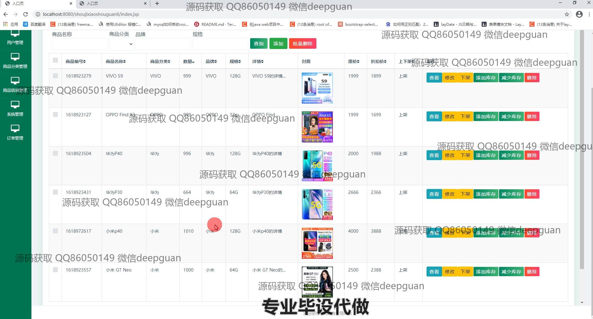
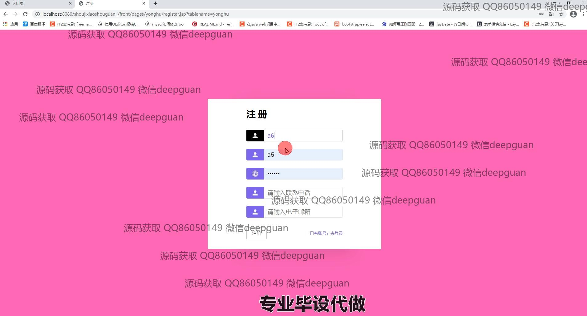
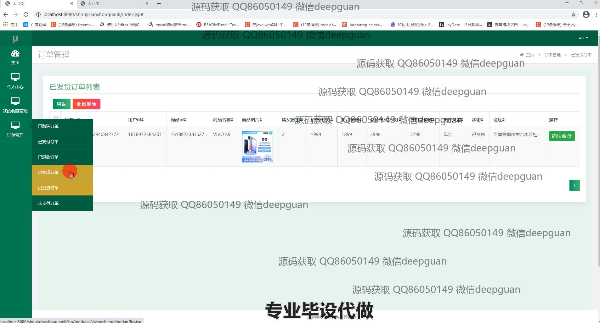

<h1 align="center">品牌手机销售信息系统</h1>

## 简介
品牌手机销售信息系统：角色分为管理员、用户；功能包含个人中心、用户管理、商品分类管理、商品信息管理、订单管理、购物车、地址管理、充值与支付。    --计算机毕业设计源码；毕设源码；java毕业设计源码

## 联系方式

<h3 align="center">获取完整代码与数据库文件 + 微信：deepguan QQ: 86050149 QQ群: 783742310</h3>

<h3 align="center">可帮忙远程部署 包运行成功！提供远程部署、修改代码、设计文档指导、代码讲解等服务！</h3>

## 功能介绍（完整见运行截图）
管理员：基本功能包括登录和注册，系统提供商品分类管理、商品信息管理、用户管理、订单管理、系统管理等模块。管理员可以查看和编辑商品信息，上传商品图片，调整价格、库存，处理用户订单及状态，查看用户信息，对用户地址和账户信息进行管理，并管理和维护系统设置及后台数据。

用户：用户可以通过注册和登录访问系统，浏览和管理个人信息，通过个人中心查看订单状态、编辑收货地址和管理收藏商品。在商品模块中，用户可以查看商品详情，通过购物车进行购买，选择支付方式进行在线付款，参与积分兑换和促销活动。用户还可以通过系统的搜索功能查找特定商品，进行下单和提交反馈。

游客：游客可以在网站首页浏览产品推荐和最新消息，查看商品列表和商品详情，了解促销活动和产品特性。游客需要注册或登录以加入购物车并完成交易，查看更多商品细节及用户评论。

开发者：负责设计网站界面，开发功能模块，包括用户管理、商品管理、订单系统、搜索功能和支付接口。开发者确保系统的安全性和稳定性，优化用户体验，处理反馈和bug修复，进行系统的迭代和更新，以满足用户和市场需求。

## 运行截图

本代码来源于网络,仅供学习参考使用!

